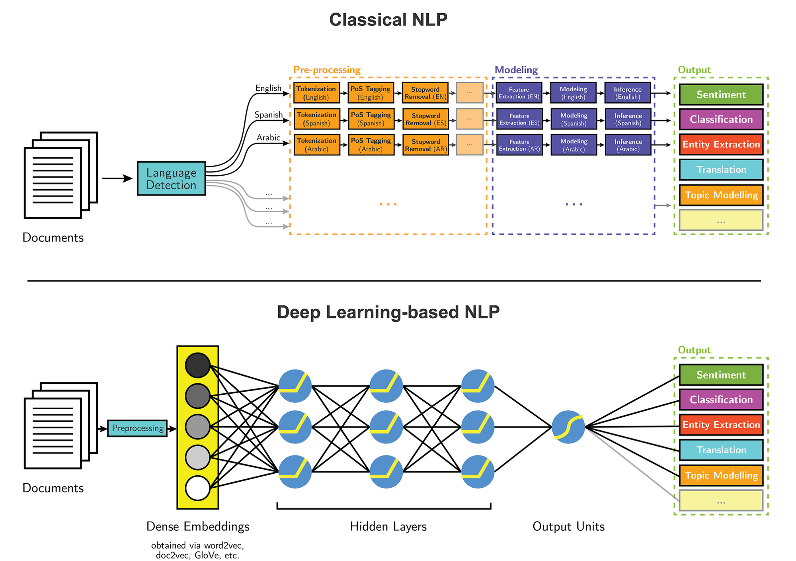

## Identify and Classify Toxic Online Comments

### The dataset

For my fourth project, I chose the __[Toxic Comment Classification dataset on Kaggle](https://www.kaggle.com/c/jigsaw-toxic-comment-classification-challenge#description)__, where I was challenged to build a model that’s capable of detecting different types of toxicity in online comments such as threats, obscenity, insults, and identity-based hate.

Google's Conversation AI team is working on tools to help improve online conversations as the threat of abuse and harassment online lead many people to stop expressing themselves and give up on seeking different opinions. To better their current models in detecting toxic comments, they set up a competition on Kaggle hoping to help online discussions become more productive and respectful.

### The Deep Learning Approach

One of the widely used Natural Language Processing (NLP) tasks in different business problems is text classification, whose goal is to automatically classify a text document into one or more predefined categories. It’s an example of a supervised machine learning algorithm, since a labelled dataset is used for training a classifier.

Here, the requirement is to build a multi-headed model that is capable of detecting different types of toxicity like threats, obscenity, insults and identity-based hate to improve Jigsaw/Google's current models. 

In **multi-headed classification**, data can belong to more than one label simultaneously. For example, in our case a comment may be toxic, obscene, and insulting at the same time. It may also happen that the comment is non-toxic and hence does not belong to any of the six labels.

Deep learning is a subset of machine learning that uses a model of computing that's very much inspired by the structure of the brain. Hence, we call this model a neural network. In recent times, deep learning has transformed the fields of Natural Language Processing (NLP), where **deep neural networks** have achieved state-of-the-art performance.

